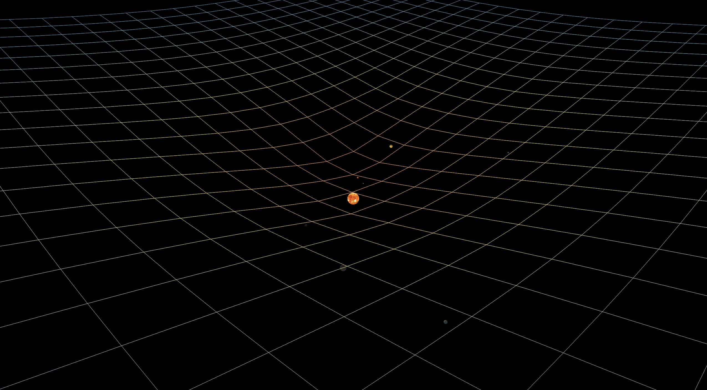

 
    <h2> Celestial Body Movement Simulator </h2>    

    

A 3D solar-system simulation built with Swift. A glowing Sun at the center, eight planets orbiting on fixed tracks, real surface textures, and a live spacetime-bending grid visualized via the Schwarzschild radius formula.

---

## 1. Features

- **Solar system demo**: Sun + eight planets (Mercury, Venus, Earth, Mars, Jupiter, Saturn, Uranus, Neptune), orbiting on fixed tracks, inner fast / outer slow
- **Real textures**: planet surfaces from Solar System Scope (CC BY 4.0); Earth includes a normal map
- **Spacetime-bending grid**: recomputed every frame from the Schwarzschild radius `rs = 2GM/c²`, colored with a heat gradient by bend depth (warm well-bottom / cool flat), so the ripples swept by orbiting planets are visible in real time
- **Orbit camera**: drag to rotate, scroll to zoom, middle-drag / WASD to pan, K to pause, Q to quit
- Pure Swift + SceneKit, no third-party dependencies

---

## 2. Directory Structure

<pre>
<code>.
├── src/                             # Swift implementation
│   ├── Package.swift
│   └── Sources/GravitySim/
│       ├── GravitySimApp.swift      # AppKit bootstrap
│       ├── Physics.swift            # Physics engine (orbits / gravity / collision)
│       ├── GridMesh.swift           # Spacetime-bending grid + heat-gradient coloring
│       ├── CameraController.swift   # Orbit camera
│       ├── InputController.swift    # Input handling
│       ├── SceneBuilder.swift       # Scene setup (solar system / lights / textures)
│       ├── SimulationRenderer.swift # Per-frame render loop
│       └── Resources/Textures/      # Planet texture assets
├── gravity_sim/                     # Original C++ version (kavan010/gravity_sim)
├── README.md
└── LICENSE                          # MIT License</code>
</pre>

---

## 3. Controls

| Input | Action |
|---|---|
| Left-drag | Rotate view (around the scene center) |
| Scroll wheel | Zoom in / out |
| Middle-drag / WASD / Space+Shift | Pan view |
| K | Pause / resume |
| Q | Quit |

---

## 4. Physics Notes

- Planets follow **fixed circular orbits** around the Sun (demo periods, inner fast / outer slow); the Sun is fixed at the center and self-lit
- The grid bends by the **Schwarzschild radius** plus a center-of-mass vertical shift; color = heat gradient of bend height
- Bend formula matches the original C++: per grid vertex, accumulate `dz = 2·√(rs·(d−rs))`
- Orbit / interaction fixes over the original: deltaTime integration replaces the `/94` frame-rate coupling, arrow-key axes are separated, K is a true toggle

---

## 5. Acknowledgments

- Planet textures: [Solar System Scope](https://www.solarsystemscope.com/textures/), CC BY 4.0
- C++ ref implementation: [kavan010/gravity_sim](https://github.com/kavan010/gravity_sim), kept as a git submodule in `gravity_sim/`

---

#### ⚠️ License: This project is open-source. See Details [LICENSE](LICENSE).
